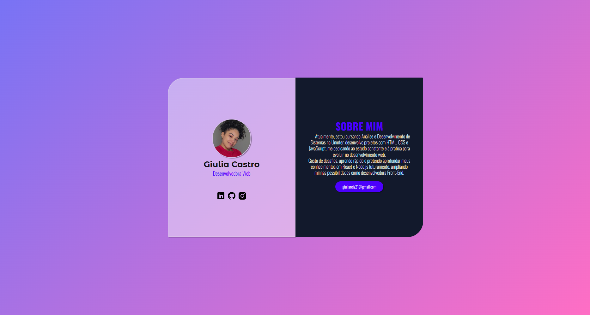
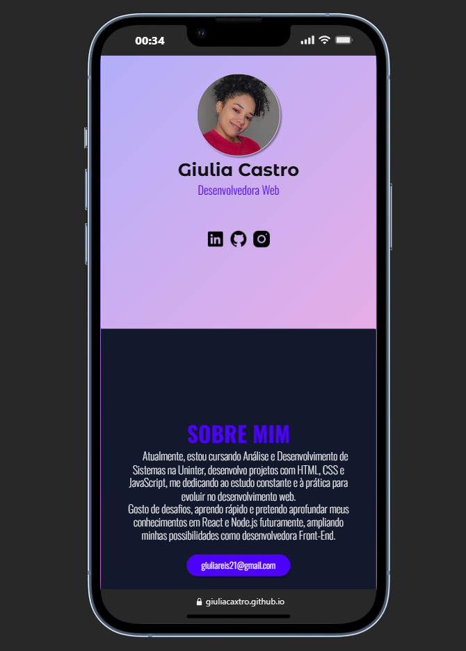
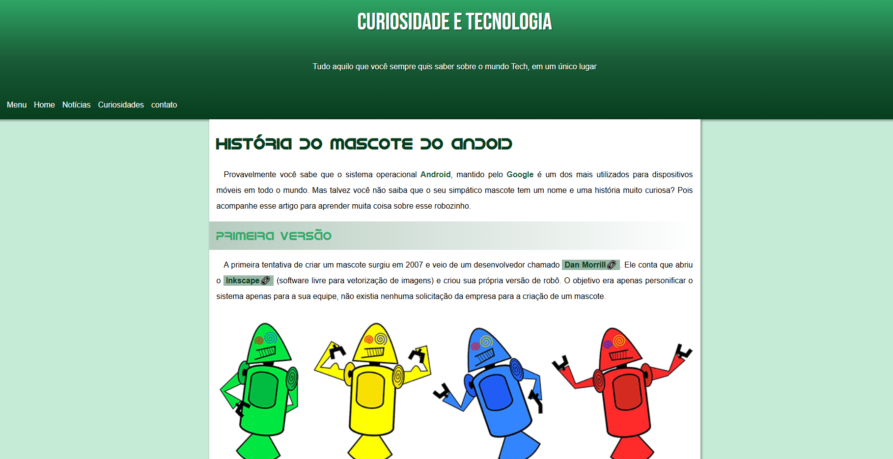

# 🙋🏽‍♀️ Giulia Castro

**`Desenvolvedora Font end`**

Me chamo Giulia Castro, tenho 28 anos e sou natural de Estado do Pará. Atualmente, estou cursando Análise e Desenvolvimento de Sistemas na Uninter, com foco em desenvolvimento Front End. Tenho interesse em criação de interfaces responsivas, Conhecimentos e Desenvolvimento de projetos Front-End utilizando HTML, CSS e JavaScript, com prática em estruturação, estilização e interatividade de páginas web. 

- Conhecimento básico em Python.
- Estudo contínuo de tecnologias modernas e interesse em evolução para React e Node.js, visando atuação Full-Stack.

   

   
    
  

---

### 🤖 Linguagens e Tecnologias

 
### 📚 Estudando..

 

### 📊 Estatísticas

 

</body>
</html>

---

# 💻 Meus Projetos de Estudo em HTML e CSS

Este repositório contém alguns projetos que desenvolvi enquanto estudava **HTML, CSS e JavaScript**.
Cada projeto foi feito com foco em aprender conceitos específicos do desenvolvimento web.

---
## 🎬 Projeto Netflix com IA(Perfis)

🔗 Acessar pagina: https://giuliacaxtro.github.io/Meus-projetos/projeto-netflix/

 Acessar repositorio: https://github.com/GiuliaCaxtro/Meus-projetos/blob/main/projeto-netflix

Este projeto foi desenvolvido durante a **Imersão Front-End na Era da IA da Alura**.

Ele simula a tela de seleção de perfis da Netflix, com foco em **interface moderna, responsividade e interatividade**.

### 🧠 O que foi praticado:

* Estrutura semântica com HTML
* Estilização avançada com CSS (variáveis e responsividade)
* Manipulação do DOM com JavaScript
* Alternância entre **modo claro e escuro**
* Uso de **localStorage** para salvar preferências do usuário
* Boas práticas de organização de código

### ✨ Destaques:

* Interface inspirada em plataforma real
* Efeitos de hover e transições suaves
* Layout responsivo (mobile e desktop)
* Melhorias com apoio de Inteligência Artificial

---

## 👤 Card de Perfil - Giulia Castro

Projeto de **card de perfil profissional** desenvolvido com HTML e CSS, focado em design moderno, organização e responsividade.

🔗 Acesse: https://giuliacaxtro.github.io/card-perfil/

Acesso repositório do projeto: https://github.com/GiuliaCaxtro/card-perfil

### 🚀 Tecnologias

* HTML5
* CSS3
* Google Fonts

### 🎯 Funcionalidades

* Foto, nome e profissão
* Links para redes sociais
* Seção "Sobre mim"
* Botão de contato por e-mail
* Layout moderno com efeito glassmorphism

### 💡 Aprendizados

* Estrutura semântica
* Flexbox
* Responsividade
* Organização de código
* Variáveis CSS

----

## 📱 Projeto Android

🔗 **Acessar projeto:**
https://giuliacaxtro.github.io/Meus-projetos/projeto-android/

Este projeto foi criado do zero com **HTML e CSS**.
O objetivo foi praticar a **estrutura de um site completo**, trabalhando com:

* Estrutura HTML
* Estilização com CSS
* Organização de conteúdo
* Layout de página

---

## 📜 Projeto Cordel

🔗 **Acessar projeto:**
https://giuliacaxtro.github.io/Meus-projetos/projeto-cordel/

Neste projeto eu pratiquei principalmente:

* Posicionamento de imagens de fundo
* Uso de background no CSS
* Efeitos visuais em seções da página
* Estilização de texto estilo cordel

---

## 🔗 Projeto Páginas

🔗 **Acessar projeto:**
https://giuliacaxtro.github.io/Meus-projetos/projeto-paginas/

Este projeto foi feito para aprender:

* Links externos
* Navegação entre múltiplas páginas
* Estrutura de navegação em um site
* Organização de arquivos HTML

---

## 🚀 Tecnologias utilizadas

* HTML5
* CSS3
* JavaScript

---

📚 Estes projetos fazem parte do meu processo de aprendizado em **desenvolvimento web**.

